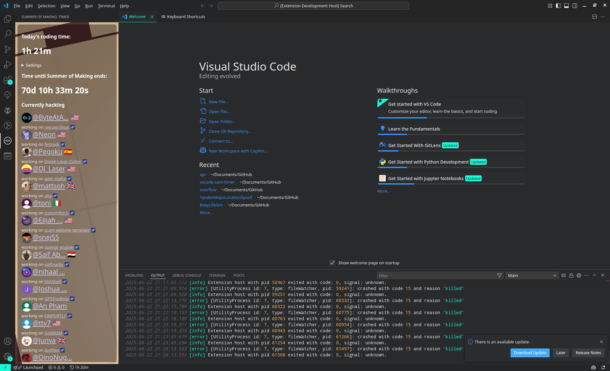

# VSCode Summer of Making timer

This is a very simple extension that lets you track your Hacktime time and time until the Summer of Making deadline without leaving your editor! You can leave it on the right side and it will update from time to time.

## Setup
[Download the extension from the extension marketplace](https://marketplace.visualstudio.com/items?itemName=milkcool.vscode-som-timer). (Alternatively, download the [latest release](https://github.com/Milk-Cool/vscode-som-timer/releases) and install it in VSCode using Extensions -> Three dots -> Install from VSIX.) Then, open the extension view from the left side panel or from command palette, go to settings and paste in your [Hackatime token](https://hackatime.hackclub.com/my/settings).

## A word of advice
~~PLEASE DO NOT PLAY WITH THE EXTENSION! If you reopen the view a few too many times, you **WILL LIKELY GET BANNED**!~~

Nevermind, that was a false ban